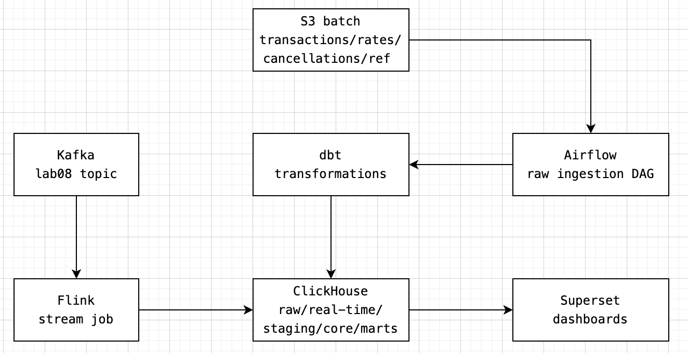

# Lab08: Lambda pipeline на ClickHouse, Airflow, dbt, Flink и Superset

Проект реализует аналитический пайплайн для обработки транзакций, отмен, курсов валют, пользователей и промокодов. Данные поступают двумя путями:

- batch-слой из S3 загружается через Airflow в ClickHouse;
- real-time слой из Kafka обрабатывается Flink job и пишет события в ClickHouse;
- dbt строит staging/core/marts поверх batch-данных;
- Superset автоматически поднимает подключение к ClickHouse и импортирует готовые дашборды.

Основная цель проекта — получить воспроизводимый аналитический стенд, который одной командой поднимает инфраструктуру, загружает данные, строит витрины и позволяет показать batch- и real-time-аналитику в Superset.

## Архитектура



Batch-слой считается основным источником для точных витрин. Real-time слой нужен для демонстрации свежего потока событий из Kafka и мониторинга текущей загрузки.

## Что внутри

```text
.
├── airflow/
│   ├── Dockerfile
│   ├── dags/
│   │   ├── lab08_raw_ingestion.py
│   │   └── lab08_marts.py
│   └── scripts/
│       └── create_clickhouse_connection.sh
├── clickhouse/
│   └── init/
│       ├── 001_init.sql
│       └── 002_stream_objects.sql
├── dbt/
│   ├── dbt_project.yml
│   ├── profiles.yml
│   └── models/
│       ├── staging/
│       ├── core/
│       └── marts/
├── flink/
│   └── jobs/
│       └── lab08-stream-job/
│           ├── pom.xml
│           └── src/
├── superset/
│   ├── Dockerfile
│   ├── superset_config.py
│   ├── assets/
│   │   ├── dashboard_export_dq.zip
│   │   ├── dashboard_export_rt.zip
│   │   └── dashboard_export_transactions.zip
│   └── scripts/
│       ├── create-clickhouse-connection.sh
│       ├── import-superset-assets.sh
│       └── init-superset.sh
├── docker-compose.yml
├── .env.example
└── README.md
```

## Компоненты

| Компонент | Назначение |
|---|---|
| ClickHouse | Основное аналитическое хранилище для raw-таблиц, dbt-моделей, real-time таблиц и витрин |
| Airflow | Оркестрация batch-загрузки из S3 и запуска dbt-трансформаций |
| dbt | Построение staging/core/marts слоев в ClickHouse |
| Flink | Чтение Kafka-топика и запись real-time событий в ClickHouse |
| Superset | BI-слой, дашборды и визуализации |
| PostgreSQL | Служебная metadata database для Airflow |
| Maven | Сборка Flink job внутри Docker Compose |

Kafka в `docker-compose.yml` не поднимается, используется внешний брокер.

## Быстрый запуск

1. Клонируйте репозиторий:

```bash
git clone https://github.com/zemnuhos/lab08-lambda-clickhouse-flink.git
cd lab08-lambda-clickhouse-flink
```

2. Авторизуйтесь в GitHub Container Registry.

```bash
echo <GITHUB_PAT> | docker login ghcr.io -u <GITHUB_USERNAME> --password-stdin
```
Где:
- `<GITHUB_USERNAME>` — GitHub username
- `<GITHUB_PAT>` — Personal Access Token

3. Скачайте опубликованный образ

```bash
docker compose pull
```

4. Скопируйте пример переменных окружения:

```bash
cp .env.example .env
```

5. При необходимости поправьте значения в `.env`.

Минимально для локальной проверки можно оставить значения по умолчанию.

6. Запустите весь стек одной командой:

```bash
docker compose up -d --build
```

7. Проверьте контейнеры:

```bash
docker compose ps
```

Ожидаемо должны подняться контейнеры ClickHouse, Airflow, Superset, Flink JobManager, Flink TaskManager, dbt и init/submit-сервисы.

8. Перейти в Airflow UI (ссылка на UI ниже) и включить DAG `lab08_raw_ingestion` и подождать, пока прогрузятся сырые данные.

9. Включить DAG `lab08_marts` и подождать, пока заполнится хранилище.  

10. Проверить в Flink UI, что Job `lab08-kafka-to-clickhouse-rt` появился и находится в статусе "RUNNING".

11. Открыть Superset UI и выбрать интересующий дашборд.

## Интерфейсы

| Сервис | URL | Логин / пароль по умолчанию |
|---|---|---|
| Airflow | http://localhost:8080 | `airflow` / `airflow` |
| Superset | http://localhost:8088 | `admin` / `admin` |
| Flink UI | http://localhost:8081 | не требуется |
| ClickHouse HTTP | http://localhost:8123 | `default`, пароль пустой |

Значения логинов и паролей задаются через `.env`.

## Как работает batch-пайплайн

### 1. Инициализация ClickHouse

При старте контейнера ClickHouse автоматически выполняются SQL-файлы из папки:

```text
clickhouse/init/
```

Файл `001_init.sql` создает batch raw-таблицы:

- `analytics.raw_transactions`;
- `analytics.raw_cancellations`;
- `analytics.raw_exchange_rates`;
- `analytics.raw_users`;
- `analytics.raw_test_users`;
- `analytics.raw_promo_codes`;
- `analytics.load_log`.

Файл `002_stream_objects.sql` создает real-time таблицы и view:

- `analytics.rt_transactions`;
- `analytics.rt_cancellations`;
- `analytics.rt_exchange_rates`;
- `analytics.mart_rt_current_hour_metrics`;
- `analytics.mart_rt_events_per_minute`;
- `analytics.mart_rt_data_quality_last_60m`.

### 2. Загрузка raw-данных из S3

DAG `lab08_raw_ingestion` каждые 5 минут ищет новые файлы в S3-бакете и загружает их в ClickHouse.

Загружаются:

- справочники пользователей, тестовых пользователей и промокодов;
- batch-файлы транзакций;
- дневные файлы отмен;
- дневные файлы курсов валют.

Идемпотентность сделана через таблицу `analytics.load_log`: если файл уже был успешно загружен, повторно он не вставляется.

### 3. Построение витрин через dbt

DAG `lab08_marts` запускает dbt-проект из папки `dbt/` и пересчитывает модели ClickHouse.

После успешного пересчета dbt DAG очищает таблицы `analytics.rt_*`. Это сделано для того, чтобы после batch-пересчета real-time не дублировал уже учтенные batch-данные.

## dbt-слои

Хранилище спроектировано по методологии Ральфа Кимбалла. Основные слои: Staging, Core и Marts.

### Staging

Staging-модели приводят типы, даты и технические признаки к удобному виду:

- `stg_transactions`;
- `stg_cancellations`;
- `stg_exchange_rates`;
- `stg_users`;
- `stg_promo_codes`.

### Core

Core-слой содержит очищенные факты, измерения и технический DQ-карантин:

- `dim_users`;
- `dim_promo_codes`;
- `dim_exchange_rates`;
- `fact_transactions`;
- `fact_cancellations`;
- `fact_cancellation_matches`;
- `dq_transactions_duplicate`.

### Marts

Витрины для Superset:

- `mart_transactions_hourly` — распределение транзакций по часам;
- `mart_purchases_hourly` — успешные покупки по часам;
- `mart_revenue_daily` — дневная gross/net выручка в TGRK;
- `mart_promo_usage` — использование промокодов, лимиты и просроченные применения;
- `mart_traffic_source_daily` — реальные и тестовые пользователи;
- `mart_currency_daily` — разрез по валютам с пересчетом в TGRK;
- `mart_cancellations_daily` — отмены, причины, match status и среднее время до отмены;
- `mart_user_cohorts` — когорты пользователей по первой успешной покупке;
- `mart_data_quality_daily` — витрина качества данных.

## Как работает real-time слой

Flink job находится в папке:

```text
flink/jobs/lab08-stream-job/
```

При запуске `docker compose up -d --build` Maven-сервис `stream-init` собирает Java job и кладет JAR в папку `flink/jobs/`. После этого сервис `flink-stream-job-submit` отправляет job во Flink cluster.

Job читает Kafka-топик `lab08_transactions`, разбирает поле `_source` и маршрутизирует события:

| `_source` | ClickHouse table |
|---|---|
| `transaction` | `analytics.rt_transactions` |
| `cancellation` | `analytics.rt_cancellations` |
| `exchange_rate` | `analytics.rt_exchange_rates` |

Для записи в ClickHouse используется HTTP-вставка в формате `JSONEachRow`.

## Superset

Superset собирается из собственного Dockerfile, потому что для ClickHouse нужен Python-драйвер `clickhouse-connect`.

При первом запуске `superset-init` выполняет:

1. миграции metadata database Superset;
2. создание admin-пользователя;
3. инициализацию ролей и прав;
4. создание database connection к ClickHouse;
5. импорт дашбордов из `superset/assets/*.zip`.

В проекте сохранены экспортированные dashboard bundles:

- `dashboard_export_transactions.zip`;
- `dashboard_export_dq.zip`;
- `dashboard_export_rt.zip`.

## Принятые решения по данным

### Что считается покупкой

Покупкой для бизнес-витрин считается транзакция, у которой одновременно выполнены условия:

```text
transaction_type = 'purchase'
status = 'completed'
```

Такой подход отделяет все события-транзакции от фактически успешных покупок.

### Дубли transaction_id

В staging-слое строится технический ключ `transaction_nk` на основе файла/слота и `transaction_id`. Если по этому ключу найдено несколько строк, они помечаются как дубли.

Дубли не попадают в `fact_transactions`. Они выносятся в отдельную таблицу:

```text
analytics.dq_transactions_duplicate
```

Это позволяет не искажать бизнес-метрики и одновременно показывать проблему качества данных на отдельном дашборде.

### Пустые и неизвестные пользователи

Пустой `user_uuid` не ломает пайплайн и помечается флагом `is_empty_user`.

Если `user_uuid` заполнен, но пользователь не найден в справочнике, транзакция остается в факте, но получает флаг `is_unknown_user`.

### Тестовые пользователи

Тестовые пользователи не удаляются из данных. Вместо этого в фактах сохраняется признак `is_test_user`, чтобы в Superset можно было анализировать реальные и тестовые данные отдельно.

### Отрицательные и нулевые суммы

Отрицательные и нулевые суммы не фильтруются. Они сохраняются в фактах и помечаются флагами:

- `is_negative_amount`;
- `is_zero_amount`.

Это дает возможность учитывать такие строки в DQ-метриках, не теряя исходные данные.

### Курсы валют

Базовая валюта — `TGRK`. Для валют `PUNK` и `RUB` строится интервальная таблица курсов `dim_exchange_rates`.

Для транзакции выбирается последний известный курс на момент `created_at`. Если курс не найден, транзакция помечается флагом `is_rate_missing`.

### Отмены

Отмены обрабатываются отдельным фактом и сопоставляются с транзакциями в `fact_cancellation_matches`.

Допущение: отменой считается событие, пришедшее **только на следующий день** после транзакции, остальные отмены игнорируются

Статус сопоставления:

- `matched` — найдена одна подходящая транзакция;
- `ambiguous` — найдено несколько кандидатов;
- `unmatched` — транзакция не найдена.

Такой подход заставляет пайплайн не падать из-за несопоставленных отмен.

### Промокоды

Использование промокодов анализируется через `mart_promo_usage`. В витрине есть:

- общее количество использований;
- количество успешных покупок с промокодом;
- использования просроченных промокодов;
- процент использования лимита;
- признак превышения лимита;
- выручка по успешным покупкам.

## Проверка после запуска

Проверить Airflow DAGs:

```bash
docker compose logs airflow-scheduler --tail=100
```

Проверить Flink job:

```bash
docker compose logs flink-stream-job-submit --tail=100
```

Проверить raw-таблицы ClickHouse:

```bash
docker compose exec clickhouse clickhouse-client --database analytics --query "
SELECT 'raw_transactions' AS table_name, count() AS rows FROM raw_transactions
UNION ALL
SELECT 'raw_cancellations', count() FROM raw_cancellations
UNION ALL
SELECT 'raw_exchange_rates', count() FROM raw_exchange_rates
FORMAT PrettyCompact
"
```

Проверить batch-витрины:

```bash
docker compose exec clickhouse clickhouse-client --database analytics --query "
SELECT 'mart_transactions_hourly' AS table_name, count() AS rows FROM mart_transactions_hourly
UNION ALL
SELECT 'mart_purchases_hourly', count() FROM mart_purchases_hourly
UNION ALL
SELECT 'mart_revenue_daily', count() FROM mart_revenue_daily
UNION ALL
SELECT 'mart_promo_usage', count() FROM mart_promo_usage
FORMAT PrettyCompact
"
```

Проверить real-time витрины:

```bash
docker compose exec clickhouse clickhouse-client --database analytics --query "
SELECT *
FROM mart_rt_events_per_minute
ORDER BY event_minute DESC
LIMIT 10
FORMAT PrettyCompact
"
```

## Полный сброс стенда

Удалить контейнеры и persistent volumes:

```bash
docker compose down -v --remove-orphans
```

После этого можно поднять проект заново:

```bash
docker compose up -d --build
```
